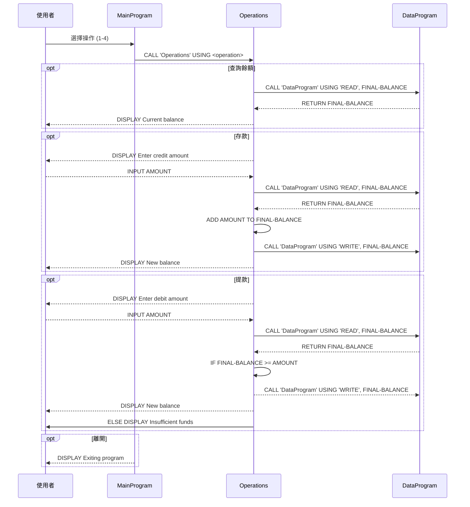

# COBOL Student Account System Documentation

這份文件說明 `src/cobol` 資料夾中每個 COBOL 檔案的用途、關鍵功能，以及與學生帳戶相關的業務規則。

## 檔案概覽

### `main.cob`
- 程式名稱: `MainProgram`
- 功能: 提供互動式帳戶管理選單，讓使用者選擇檢視餘額、存款、提款或離開程式。
- 關鍵流程:
  - 顯示選單並要求使用者輸入 1-4 之間的選項。
  - 根據選擇呼叫 `Operations` 程式並傳遞對應的操作參數。
  - 當使用者選擇 4 時結束迴圈並離開程式。
- 與學生帳戶相關規則:
  - 沒有直接計算帳戶餘額，僅將操作類型轉送到 `Operations`。
  - invalid choice 會提示使用者重新輸入。

### `operations.cob`
- 程式名稱: `Operations`
- 功能: 根據傳入的操作類型執行帳戶查詢、存款或提款邏輯。
- 關鍵功能:
  - `TOTAL`: 讀取現有帳戶餘額並顯示。
  - `CREDIT`: 讀取使用者輸入的存款金額，從資料程式讀取目前餘額，將金額加入後寫回儲存，並顯示更新後的餘額。
  - `DEBIT`: 讀取使用者輸入的提款金額，讀取目前餘額，檢查是否有足夠資金，若足夠則扣款並寫回儲存；否則顯示「不足資金」訊息。
- 與學生帳戶相關規則:
  - 存款後會更新帳戶餘額。
  - 提款前會進行餘額檢查，若餘額不足則拒絕交易並提示使用者。
  - 使用 `CALL 'DataProgram'` 將帳戶資料讀寫分離。

### `data.cob`
- 程式名稱: `DataProgram`
- 功能: 管理帳戶餘額的讀取與寫入，充當簡單的記憶體資料存取層。
- 關鍵功能:
  - `READ`: 將內部 `STORAGE-BALANCE` 內容回傳到呼叫者的 `BALANCE` 參數。
  - `WRITE`: 將呼叫者傳入的 `BALANCE` 參數值存回內部 `STORAGE-BALANCE`。
- 與學生帳戶相關規則:
  - 初始帳戶餘額為 `1000.00`。
  - 這個檔案負責保持帳戶餘額狀態，並由 `Operations` 作為資料存取層使用。

## 總結
- `main.cob` 負責使用者互動和選單流程。
- `operations.cob` 負責帳戶操作邏輯，包括查詢、存款和提款。
- `data.cob` 負責帳戶餘額的讀寫狀態管理。
- 主要學生帳戶業務規則:
  - 初始餘額 `1000.00`。
  - 存款會增加餘額並更新儲存值。
  - 提款必須先檢查餘額，若不足則拒絕交易。
  - 所有帳務操作皆透過 `DataProgram` 進行資料存取。

## 資料流序列圖

